+++
author = "Nicolas Chaulet"
title = "Building a wall tool for an architectural drawing app"
date = "2025-02-27"
description = "Taking a deep dive into the intricacies of building a tool that allows users to draw walls in a 2D architectural drawing application"
+++
**This feature was developed during my time as a CTO of Canoa.**

Canoa excels at handling CAD blocks for objects and images, and we’ve recognized recently the need to also add more intuitive architectural drawing tools. I just finished developing a new tool that allows users to draw walls intuitively with Canoa. and want to share how we built it. First, let’s start with our product prompt:

- It should be as easy to draw a wall as it is to draw lines
- Drawing walls should be precise
- Walls should have a particular graphical representation that makes them stand apart from a basic thick line
- Editing walls once they are drawn should be intuitive
- Users should be able to join walls together
- Users should be able to delete a section of a wall to create an opening
- Users should be able to change the thickness of each wall segment

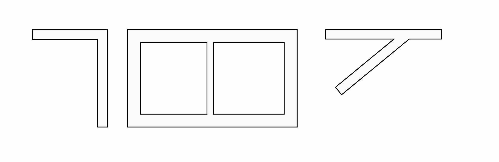

Examples of various visual representations that should all be possible

One last technical constraint was that users should be able to draw the wall geometry using basic polygons and a line drawing tool. This ensures that walls are easy to render on the screen and that they can be exported to various vector graphics file formats (SVG, DWG, DXF).

## End result

Here’s a quick demo of where the tool landed, which gets close to the objectives set out in our initial prompt:



A few notes about the functionality:

- Wall corners render like a “miter” join when rendering a stroke in svg or HTML canvas (see [https://developer.mozilla.org/en-US/docs/Web/SVG/Attribute/stroke-linejoin](https://developer.mozilla.org/en-US/docs/Web/SVG/Attribute/stroke-linejoin) for more join types)
- Dragging a point that connects two or more wall segments together modifies each segment as opposed to modifying only one segment and therefore detaching it from the other segments
- The user can snap the end of one wall segment with the middle of another wall segment, creating a T-junction

## Where I started - extend polylines

I started by treating walls as a thick polyline (which is a series of connected line segments). The logic for handling polylines was already built so it felt like a good place to start. The wall was stored in the database as a sequence of points and a thickness value:

```tsx
type Wall = {
	geometry: Array<{
		x:number;
		y:number;
	}>;
	thickness: number;
}
```

In that scenario, the `geometry` attribute holds the location of the center line of the wall. In order to render the wall as a polygon with an outline, I then computed the offset from that centerline on both sides.

While it’s fairly basic, this approach gave some promising results with one main issue: T-style junctions were not coming out nicely (as expected).


A T-junction that does not render properly


Another example of a T-junction that does not render properly

At that point I tried a few tricks with layering, rendering order, polygon clipping, etc. But nothing was really working. 

In addition to the rendering issue, the UX of working with those “disconnected” lines was not great. If you move one vertex of one of the walls, you still want the two wall sections to stay attached. I had to fully embrace the idea that walls are not just thick polylines, they behave more like a network of points. 

This led me to revisit this great post about the **vector networks** in Figma might actually work: [https://alexharri.com/blog/vector-networks](https://alexharri.com/blog/vector-networks) (credit goes to Nick Schmidt for the find 🙏). And reading through this, yes it totally makes sense in many ways to treat a wall system as a network, it would certainly help with the T-junction problem highlighted above.

## Walls as a vector network

Instead of storing the centerline of the wall as a polyline I decided to store it as a network of points:

```tsx
type Wall = {
  geometry: {
    nodes: Array<{
      x: number;
      y: number;
    }>;
    edges: Array<{
      v1: number;
      v2: number;
      style: Record<string, any>
    }>
  };
  thickness: number;
};
```

and this made whole kinds of things way easier. I am now within very classic Computer Science land working with a non-directed graph. The graph’s nodes are the vertices of my wall segments and each segment is an edge connecting two nodes together. Nodes are also indexed by their spatial position, that is to say that if two nodes are really close to one another they are just the same node. With this structure in place, the T-junction above can easily be represented with four nodes and three edges, in purple in the picture below:


Example of a T-junction that renders properly

If you ignore the grey outline for a moment and focus only on the centerline, most of the interaction with the wall is straight forward:

- snapping one wall with another one is equivalent to merging the two networks together
- deleting a point equates to removing a vertex and deleting any associated edge
- deleting an edge involves removing that connection from the network and potentially having multiple networks as a byproduct (which is actually a nice outcome)
- setting custom thickness for specific wall segments is as simple as setting the `style` attribute on that particular edge

One key aspect remains, how can I get the wall outline (in red and green) from the centerline (in purple)? This is where vector networks helped once more, or at least the idea of thinking about this outline as a network of points with two cycles, the green one and the red one. I ended up defining a simple algorithm that traverses the wall’s centerline network and builds a new network that will store the outline of the wall. 

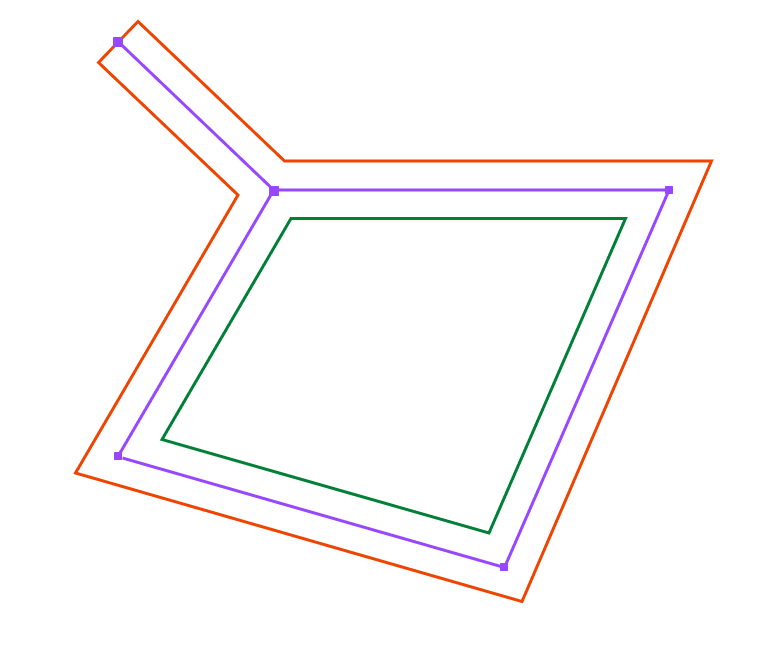

Centerline of the wall and inside and outside wall representation

In the next two sections I will outline how this algorithm works in more details, starting with the overall idea and then drill down into exactly how I resolved the location of the points that define the junctions, from now on, I will refer to those points as **miter points**.

### Building an outline network

Below are the main steps the algorithm follows:

1. pick any segment
    
    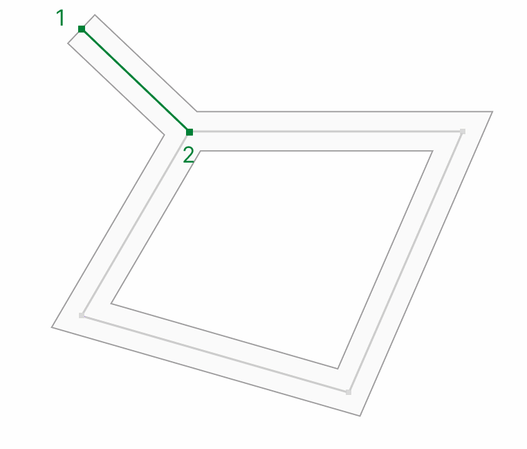
    
    First segment that the algorithm explores with its two endpoints
    
2. pick one end of that segment (point 1 in green above) and compute the two miter points associated with that end (more on that later)
3. do the same with the other end (point 2 in green)
4. this gives 4 points that can be linked together by adding the relevant edges to the outline network in purple below. 

    
    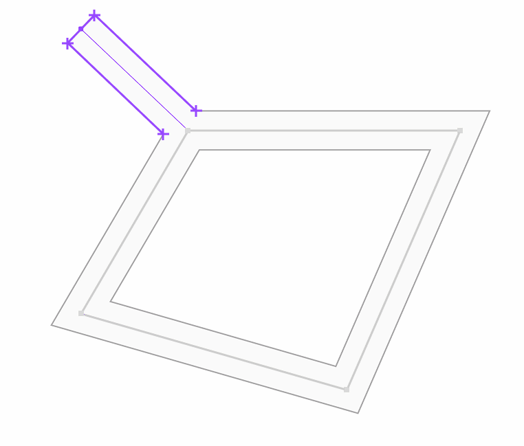
    
    Network obtained after visiting the first edge
    

Repeating that process for each edge yields the following network

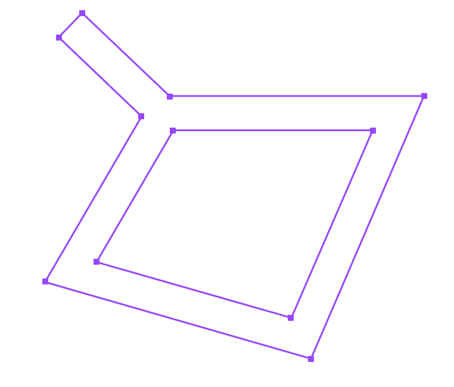

Result of the outline building algorithm

By extracting the closed cycles of that network we get the two outlines, one for the outside polygon and one for the inside polygon that can be viewed as a hole. This is actually enough information for drawing the wall using PIXI.js `Graphics` API or to export the wall geometry to other file formats such as SVG or DWG/DXF.

### Miter point calculation

Let’s start with the simplest situation: the node is an endpoint, which is to say that it is only connected to one other node:

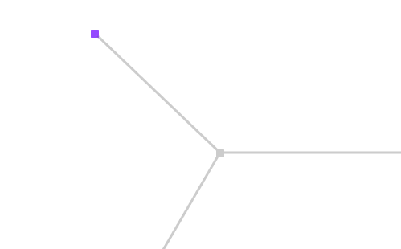

Endpoint of the wall center

Computing the two miter points in that case amounts to translating that point in the normal and the opposite normal directions as show below

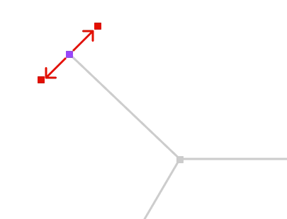

Endpoint position being translated in the normal and opposite normal directions to obtain the two miter points of an endpoint

Now, if the node connects to two other nodes the miter point location needs to be adjusted based on the angle between the two sides of that node

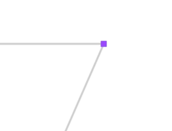

Example of a point connected to two wall sections

First let’s get the location of two offset lines on each side of the center lines, then let’s compute the miter points as being the intersection of those two lines for the “inside” and “outside” offsets:

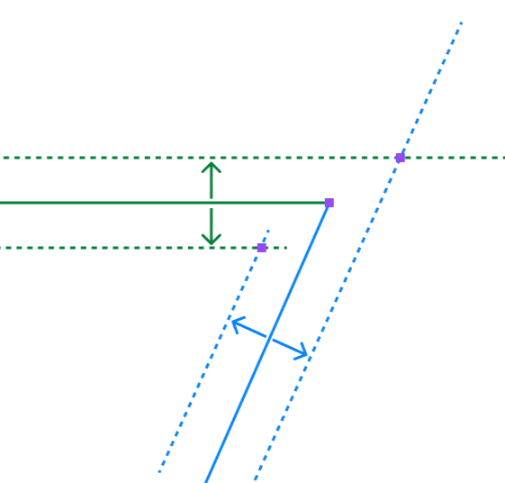

Offset the centerlines and compute their intersection to obtain the two miter points

Finally, let’s get to the 3-way junction in the example above that also covers the T-junction problem we mentioned before:

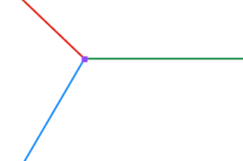

Example of a 3-way junction (or T-junction)

In that case there are 3 miter points to compute, one for each segment pair. One point for the red and blue pair, one for the green and red pair and one for the blue and green pair.

The way to get those is that to start from one segment, say the red, get the next segment by rotating in the anti-clockwise direction around the junction’s center point. This gives the blue segment. Then compute the miter point between those two lines. By repeating this procedure starting with the blue line yields a second miter point and finally starting from the green line gives the third:

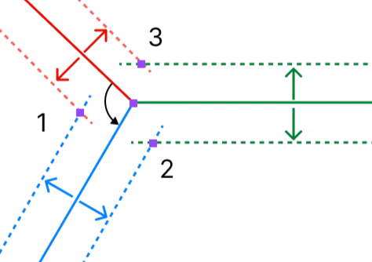

T3-way junction offset lines for computing the miter points

This technique nicely expands to junctions with any number of walls as well as with walls from different thicknesses joining together which covers any situation.

## Further exploration

There are things that I didn’t cover in that post but are worth paying attention to:

- **self-intersecting walls:** those can create issues if not handled with “shadow nodes” in the centerline network at the intersection point
- **degenerate angles:** if the angle between 2 edges gets close to 0 it is nice to fallback to a capped join instead of the default miter join
- **performance optimization:** could this all be implemented as part of a shader? Probably but in the context of Canoa, the algorithm described above implemented in Typescript was already giving a great performance, so not sure it is worth the trouble.

## Conclusion

Overall, the feature came out great and the network data structure was really nice to work with in that context. Easy to expand as product requirements evolved and very testable as well, things I definitely like! This is obviously an opinionated take on how users should interact with walls in an architectural drawing context but it is not the only way. For example I treated a T-junction as a new point in space as opposed  to a relative position along an existing wall which would give a more parametric interaction. 

## References and related reading

[Initial blog post introducing vector networks from Figma](https://www.figma.com/blog/introducing-vector-networks/)

[Breakdown of what vector networks solve for](https://alexharri.com/blog/vector-networks)

[Mozilla documentation about join types in the SVG specification](https://developer.mozilla.org/en-US/docs/Web/SVG/Attribute/stroke-linejoin)

[One of my favorite technical blog post about how to draw thick lines](https://mattdesl.svbtle.com/drawing-lines-is-hard)